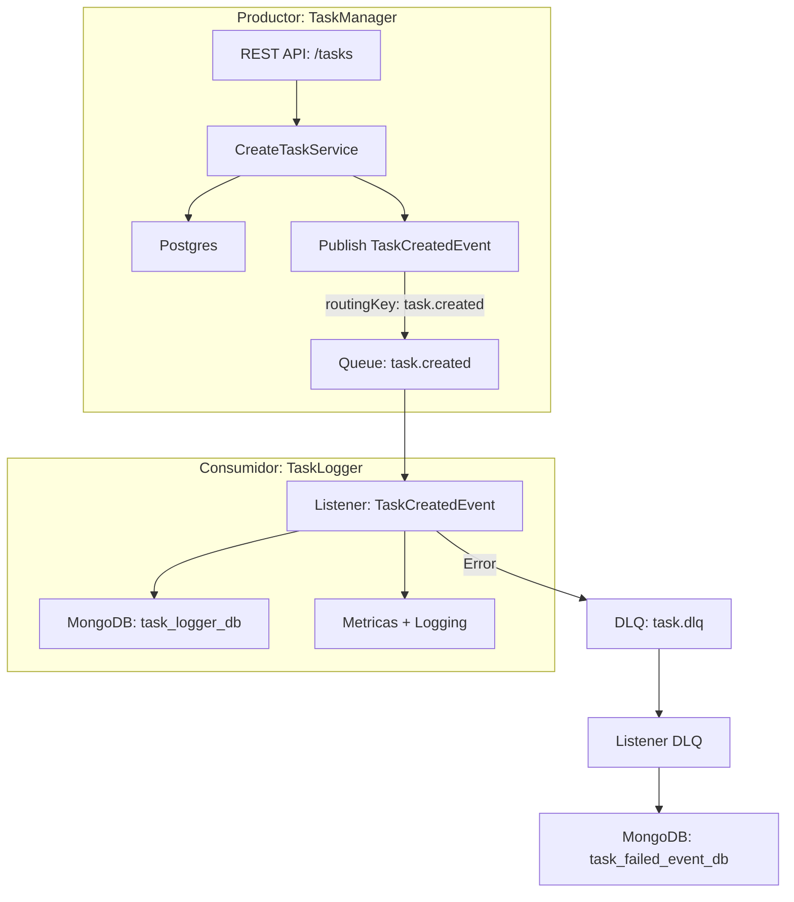

# 🧩 Task Messaging System

Este sistema está compuesto por dos microservicios independientes en Node.js, lo cuales se comunican mediante eventos asincrónicos publicados en RabbitMQ. Su objetivo principal es demostrar una arquitectura desacoplada, resiliente y observable, centrada en el manejo de tareas (Tasks).


---

## 🔧 Componentes y Tecnologías

| Proyecto             | Descripción                                                           | Tecnologías principales                              |
|----------------------|------------------------------------------------------------------------|------------------------------------------------------|
| `task-manager-node`  | Productor de eventos. Crea tareas y publica eventos (`task.created`, `task.updated`, etc).            | NestJS, PostgreSQL, RabbitMQ, Winston, Prometheus    |
| `task-logger-node`   | Consumidor de eventos. Escucha eventos y los persiste para auditoría.          | Node.js (modular), MongoDB, RabbitMQ, Prometheus     |

---

## 🔁 Flujo de Trabajo (Arquitectura)



---

## 📊 Observabilidad

Ambos proyectos están instrumentados con métricas Prometheus:

| Proyecto             | Puerto | Métricas expuestas               |
|----------------------|--------|----------------------------------|
| `task-manager-node`  | `3000` | `tasks_created_total`, `...`     |
| `task-logger-node`   | `3001` | `task_created_logged_total`, etc |

- Grafana disponible en `http://localhost:3002`
- Dashboards permiten visualizar rendimiento, errores y volumen de eventos.

---

## ✨ Características

### TaskManager-node (Productor)

- API RESTful para gestionar tareas.
- Publica eventos a RabbitMQ:
  - `task.created`
  - `task.updated`
  - `task.deleted`
- Mecanismos de resiliencia:
  - Retry con timeout y fallback.
  - Circuit Breaker.
  - Dead Letter Queue (DLQ).
- Persistencia en PostgreSQL.
- Publicación de logs JSON estructurados (Filebeat).
- Exposición de métricas para Prometheus.

### TaskLogger-node (Consumidor)

- Listener de eventos RabbitMQ.
- Persistencia de eventos en MongoDB (`task_logger_db`).
- Listener adicional para la DLQ (`task_failed_event_db`).
- Evita duplicados (idempotencia).
- Exposición de métricas para Prometheus.
- Logs estructurados vía Winston + Filebeat.


---

## 📚 Funcionalidades clave

- ✅ Publicación y consumo de eventos asincrónicos.
- ✅ Retry, DLQ y persistencia de errores.
- ✅ Logging estructurado con Winston.
- ✅ Métricas personalizadas para Prometheus.
- ✅ Paneles Grafana para monitoreo.


---

## 🔐 Buenas prácticas aplicadas

- Arquitectura modular (y desacoplada).
- Separación clara entre productor y consumidor.
- Inyección de dependencias con símbolos.
- Gestión de configuración vía `.env`.
- Observabilidad y resiliencia desde el diseño.

---

## 🚀 Ejecución en entorno local

1. Clonar el repositorio.
2. Ejecutar:

```bash
docker compose -p taskmanager-node up -d
```

3. Acceder a:
   - RabbitMQ: [http://localhost:15672](http://localhost:15672)
   - Prometheus: [http://localhost:9090](http://localhost:9090)
   - Grafana: [http://localhost:3002](http://localhost:3002)
   - TaskManager API: [http://localhost:3000/tasks](http://localhost:3000/tasks)

---

## 🐳 Docker Compose Overview

Este sistema se puede desplegar con un solo archivo `docker-compose.yml`, el cual incluye los siguientes servicios:

| Servicio         | Propósito                                                                 |
|------------------|--------------------------------------------------------------------------|
| **RabbitMQ**     | Broker de eventos entre productor y consumidor (`task.created`, etc.)     |
| **PostgreSQL**   | Base de datos relacional para el productor (`task_manager_db`).           |
| **MongoDB (x2)** | Bases de datos NoSQL para eventos fallidos (`task_failed_event_db`) y logs (`task_logger_db`). |
| **Redis**        | Soporte para cache u otras operaciones en memoria si se requiere.         |
| **Filebeat**     | Recolector de logs JSON desde los microservicios (lector de archivos `.log`). |
| **Logstash**     | Procesador que toma los logs de Filebeat y los envía a Elasticsearch.     |
| **Elasticsearch**| Almacén de logs.                                                          |
| **Kibana**       | Interfaz para visualizar y consultar logs desde Elasticsearch.            |
| **Prometheus**   | Recolector de métricas de los microservicios (latencias, contadores, etc.). |
| **Grafana**      | Interfaz de visualización para métricas recolectadas por Prometheus.      |

---

## 📊 Observabilidad con Prometheus + Grafana

Ambos microservicios (`task-manager-node`, `task-logger-node`) exponen métricas en tiempo real mediante endpoints HTTP (`/metrics`) usando `prom-client`. Estas métricas son recolectadas por **Prometheus** cada 5 segundos, incluyendo:

- Contadores de eventos (`tasks_created_total`, `tasks_deleted_total`, etc.).
- Métricas de CPU, heap, GC, y event-loop de Node.js.

Puedes visualizar estas métricas en **Grafana** accediendo a:

📍 `http://localhost:3000`  
🔐 Usuario/contraseña: `admin / admin`  
📊 Dashboard Prometheus: selecciona la fuente `Prometheus` para explorar o crear gráficos.

---

## 📁 Logs estructurados con ELK + Filebeat

Los logs generados por ambos microservicios (en formato JSON) son:

1. Escritos localmente en archivos `.log`.
2. Leídos por **Filebeat**, que los interpreta como JSON y gestiona errores de parseo.
3. Enviados a **Logstash**, que los enruta hacia Elasticsearch.
4. Visualizados en **Kibana** desde `http://localhost:5601`, usando el índice:  
   📂 `filebeat-*`

Desde Kibana puedes consultar trazas, errores, advertencias o flujos completos de eventos.

---

## ▶️ Instrucciones de uso

```bash
# Iniciar todo el sistema
docker compose -p taskmanager-node up -d

# Ver logs de Filebeat (útil para debugging)
docker logs filebeat

# Detener todos los servicios
docker compose -p taskmanager-node down
```

---

## 📎 Otros recursos

- Health check: `/health`
- Métricas Prometheus: `/metrics`
- API REST (Swagger): `/api/docs`
