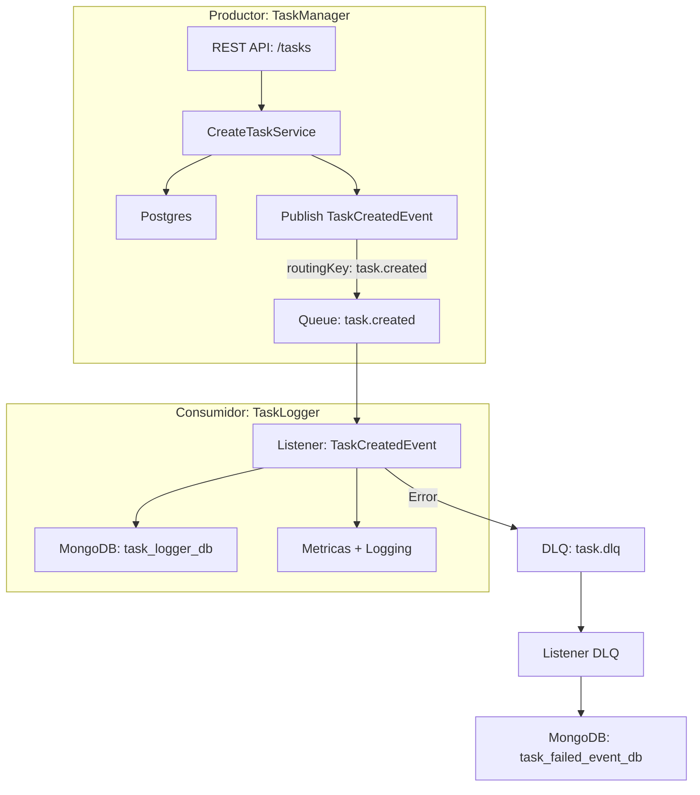

# 🧩 Task Messaging System

Este sistema está compuesto por dos microservicios independientes que se comunican mediante eventos asincrónicos publicados en RabbitMQ. Su objetivo principal es demostrar una arquitectura desacoplada, resiliente y observable, centrada en el manejo de tareas (Tasks).

---

## 📦 Estructura del Proyecto

```
.
├── task-manager-node      # Productor de eventos (creación, actualización, eliminación de tareas)
└── task-logger-node       # Consumidor de eventos (logger y persistencia de eventos recibidos)
```

---

## 🔧 Componentes y Tecnologías

| Proyecto             | Descripción                                                           | Tecnologías principales                              |
|----------------------|------------------------------------------------------------------------|------------------------------------------------------|
| `task-manager-node`  | API REST que gestiona tareas y publica eventos en RabbitMQ            | NestJS, PostgreSQL, RabbitMQ, Winston, Prometheus    |
| `task-logger-node`   | Microservicio que escucha eventos y persiste logs en MongoDB          | Node.js (modular), MongoDB, RabbitMQ, Prometheus     |

---

## 🔁 Flujo de Trabajo (Arquitectura)



---

## 📊 Observabilidad

Ambos proyectos están instrumentados con métricas Prometheus:

| Proyecto             | Puerto | Métricas expuestas               |
|----------------------|--------|----------------------------------|
| `task-manager-node`  | `3000` | `tasks_created_total`, `...`     |
| `task-logger-node`   | `3001` | `task_created_logged_total`, etc |

- Grafana disponible en `http://localhost:3002`
- Dashboards permiten visualizar rendimiento, errores y volumen de eventos.

---

## 🚀 Ejecución en entorno local

1. Clonar el repositorio.
2. Ejecutar:

```bash
docker compose -p taskmanager-node up -d
```

3. Acceder a:
   - RabbitMQ: [http://localhost:15672](http://localhost:15672)
   - Prometheus: [http://localhost:9090](http://localhost:9090)
   - Grafana: [http://localhost:3002](http://localhost:3002)
   - TaskManager API: [http://localhost:3000/tasks](http://localhost:3000/tasks)

---

## 📚 Funcionalidades clave

- ✅ Publicación y consumo de eventos asincrónicos.
- ✅ Retry, DLQ y persistencia de errores.
- ✅ Logging estructurado con Winston.
- ✅ Métricas personalizadas para Prometheus.
- ✅ Paneles Grafana para monitoreo.

---

## 🔐 Buenas prácticas aplicadas

- Arquitectura modular (y desacoplada).
- Separación clara entre productor y consumidor.
- Inyección de dependencias con símbolos.
- Gestión de configuración vía `.env`.
- Observabilidad y resiliencia desde el diseño.

---


