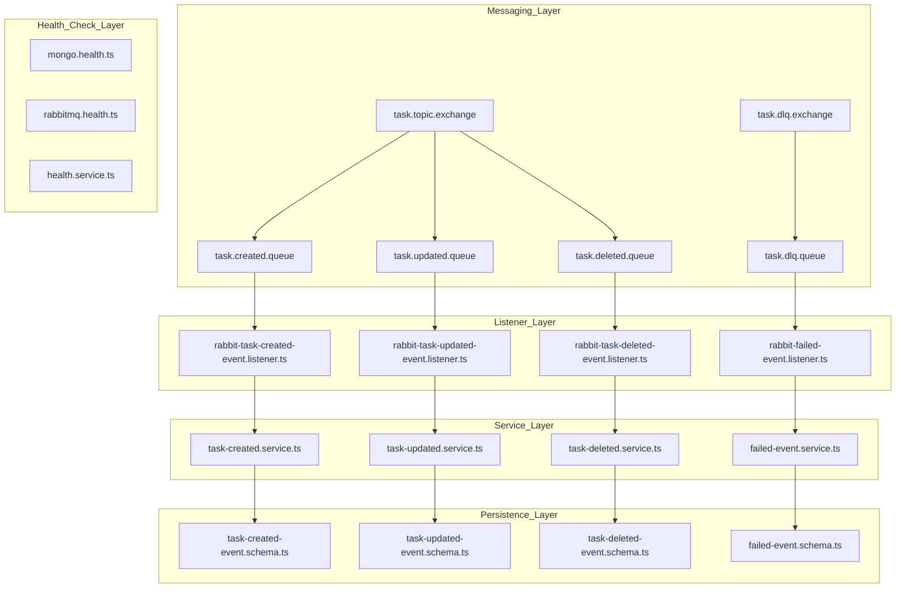
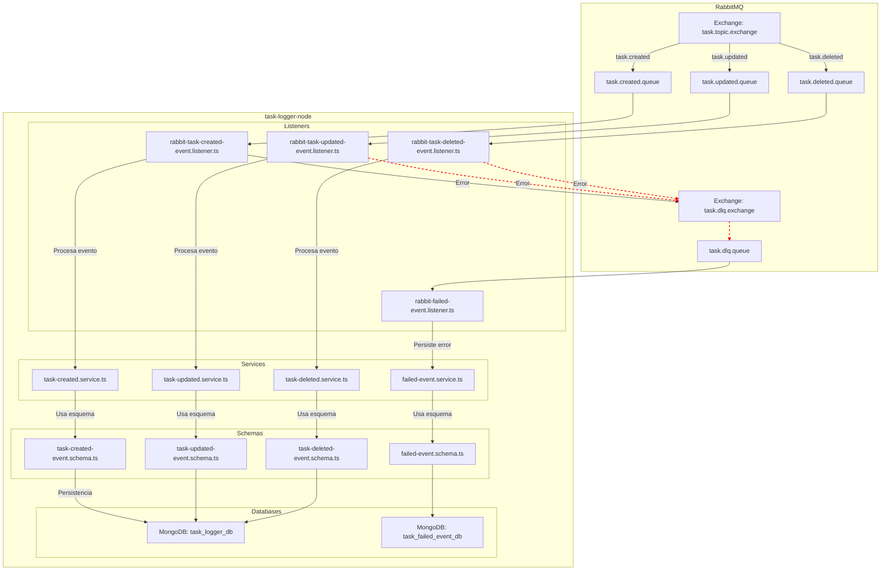

# 📝 TaskLogger-node – Event Logging Microservice for RabbitMQ Events

**TaskLogger-node** es un microservicio especializado construido con **NestJS**, diseñado para **escuchar eventos del broker RabbitMQ** relacionados con la creación, actualización y eliminación de tareas, y **persistirlos en MongoDB** para trazabilidad y auditoría. Además, gestiona una **cola Dead Letter Queue (DLQ)** para almacenar eventos fallidos y permite monitorear su procesamiento.

> 🎯 Ideal como componente de observabilidad y trazabilidad en arquitecturas orientadas a eventos.

# 📝 ¿Qué hace este proyecto?

1. Escucha eventos `task.created`, `task.updated` y `task.deleted` desde RabbitMQ.
2. Persiste los eventos correctamente procesados en MongoDB.
3. Gestiona y persiste mensajes enviados a la DLQ (Dead Letter Queue).
4. Usa Mongoose para modelar eventos como documentos de MongoDB.
5. Expone un endpoint `/health` para verificar la disponibilidad de RabbitMQ y MongoDB.
6. Aplica validaciones y logs estructurados usando `class-validator` y `winston`.

---

## ⚙️ Tecnologías y Herramientas

| Tecnología        | Rol                                        |
|-------------------|---------------------------------------------|
| **NestJS**        | Framework de backend estructurado           |
| **TypeScript**    | Tipado fuerte y mantenibilidad              |
| **RabbitMQ**      | Broker de mensajería para eventos           |
| **MongoDB**       | Persistencia de eventos                     |
| **Mongoose**      | ODM para MongoDB                            |
| **Winston**       | Sistema de logging estructurado             |
| **amqplib**       | Cliente nativo de RabbitMQ                  |
| **class-validator** | Validación declarativa de DTOs            |

---

##  📁  Estructura del Proyecto 

```bash
src/
├── app.module.ts                  # Módulo principal que importa todos los módulos necesarios del sistema.
├── main.ts                        # Punto de entrada de la aplicación NestJS.
│
├── config/                        # Configuraciones específicas del sistema
│   ├── database.constants.ts      # Constantes relacionadas con las bases de datos utilizadas.
│   └── declare-bindings.ts       # Declaración de exchanges, colas y bindings en RabbitMQ.
│
├── health/                        # Módulo de verificación de salud (health check)
│   ├── health.controller.ts      # Controlador para exponer endpoint de salud (/health).
│   ├── health.module.ts          # Módulo que agrupa los servicios y controladores de salud.
│   ├── health.service.ts         # Servicio principal que ejecuta los chequeos de salud.
│   ├── mongo.health.ts           # Verificador de estado para la conexión con MongoDB.
│   └── rabbitmq.health.ts        # Verificador de estado para la conexión con RabbitMQ.
│
├── logger/                        # Módulo de logging personalizado
│   ├── app.logger.ts             # Implementación del logger usando Winston.
│   └── logger.module.ts          # Módulo que exporta el logger a nivel global.
│
├── util/                          # Funciones utilitarias
│   ├── get-rabbitmq-uri.ts       # Construye la URI de conexión a RabbitMQ desde variables de entorno.
│   └── retry-flexible-util.ts    # Implementa lógica de retry flexible para mayor resiliencia.
│
├── common/                        # Funcionalidades comunes reutilizables
│   ├── failed-event/             
│   │   ├── failed-event.dto.ts    # DTO para eventos fallidos que llegan a la DLQ.
│   │   ├── failed-event.module.ts# Módulo que agrupa la lógica de eventos fallidos.
│   │   ├── failed-event.schema.ts# Esquema de persistencia en MongoDB para eventos fallidos.
│   │   └── failed-event.service.ts# Servicio para guardar eventos fallidos en la base de datos.
│   │
│   └── messaging/                 
│       ├── rabbit-failed-event.listener.ts     # Listener que consume mensajes desde la cola DLQ.
│       ├── rabbit-task-created-event.listener.ts # Listener para eventos task.created.
│       ├── rabbit-task-deleted-event.listener.ts # Listener para eventos task.deleted.
│       ├── rabbit-task-updated-event.listener.ts # Listener para eventos task.updated.
│       ├── rabbitmq-listener.service.ts        # Servicio genérico para conexión y consumo de colas RabbitMQ.
│       └── rabbitmq.module.ts                  # Módulo de mensajería que agrupa listeners y servicios.
│
└── task/                          # Módulo principal que maneja eventos de tareas
    ├── dto/                       # Data Transfer Objects (estructura esperada por cada tipo de evento)
    │   ├── task-created-event.dto.ts   # DTO para eventos de creación de tareas.
    │   ├── task-deleted-event.dto.ts   # DTO para eventos de eliminación de tareas.
    │   └── task-updated-event.dto.ts   # DTO para eventos de actualización de tareas.
    │
    ├── schema/                    # Esquemas de Mongoose para persistencia en MongoDB
    │   ├── task-created-event.schema.ts # Esquema de persistencia para task.created.
    │   ├── task-deleted-event.schema.ts # Esquema de persistencia para task.deleted.
    │   └── task-updated-event.schema.ts # Esquema de persistencia para task.updated.
    │
    ├── service/                   # Servicios que contienen la lógica de guardado en base de datos
    │   ├── task-created.service.ts # Servicio que persiste el evento task.created.
    │   ├── task-deleted.service.ts # Servicio que persiste el evento task.deleted.
    │   └── task-updated.service.ts # Servicio que persiste el evento task.updated.
    │
    └── task.module.ts             # Módulo general del dominio "task", agrupa servicios, DTOs y schemas.
```

---

### 🧱 Arquitectura técnica (Mermaid)



---

# Diagrama de Flujo

Este diagrama muestra el flujo completo de eventos dentro del sistema `task-logger-node`, incluyendo el consumo exitoso y el manejo de eventos fallidos con Dead Letter Queue (DLQ).




---

## 🛠️ Ejecutar en local

### 1. Instalar dependencias

```bash
npm install
```

---

### 2. Configurar variables de entorno

Ejemplo de archivo `.env`:

```env
# RabbitMQ
RABBITMQ_HOST=localhost
RABBITMQ_PORT=5672
RABBITMQ_USER=admin
RABBITMQ_PASSWORD=admin
RABBITMQ_EXCHANGE=task.events
DLQ_EXCHANGE=dlq.events

# Colas
TASK_CREATED_QUEUE=task.created.queue
TASK_UPDATED_QUEUE=task.updated.queue
TASK_DELETED_QUEUE=task.deleted.queue
TASK_DLQ=task.dlq.queue

TASK_CREATED_ROUTING_KEY=task.created
TASK_UPDATED_ROUTING_KEY=task.updated
TASK_DELETED_ROUTING_KEY=task.deleted
TASK_DLQ_ROUTING_KEY=task.dlq

# MongoDB
MONGO_URI=mongodb://localhost:27017
MONGO_DB_NAME=task_logger_db
MONGO_DLQ_DB_NAME=task_failed_event_db

# Otros
PORT=3100
```

---

### 3. Levantar dependencias con Docker

Asegúrate de tener el siguiente entorno mínimo usando Docker:

```yaml
services:
  rabbitmq:
    image: rabbitmq:management
    ports:
      - "5672:5672"
      - "15672:15672"

  mongo:
    image: mongo
    ports:
      - "27017:27017"
```

Ejecutar:

```bash
docker-compose up -d
```

---

### 4. Ejecutar la aplicación

```bash
npm run start:dev
```

---

## 📚 Observaciones

- El proyecto **no expone endpoints REST funcionales**, salvo el de salud: `GET /health`.
- Su propósito es **procesar eventos asincrónicos desde RabbitMQ** y **persistirlos en MongoDB**.
- En caso de error al procesar un mensaje, este se enruta automáticamente a la **DLQ** (Dead Letter Queue), y se guarda en una base de datos separada para análisis.
- El campo `error` en los eventos fallidos contiene el **stack trace completo** del error que provocó el fallo.
