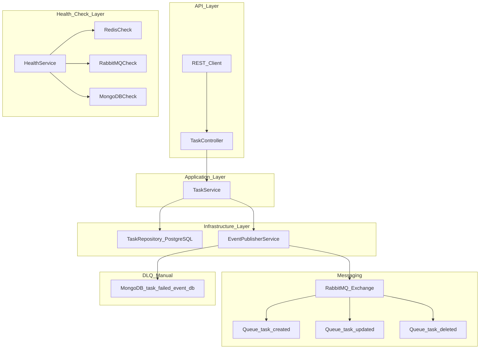
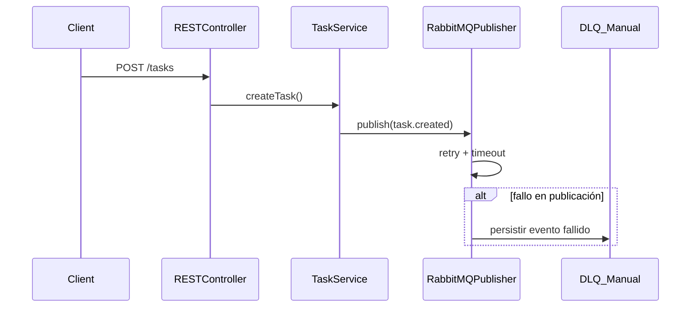

# 🧠 TaskManager-node – Event-Driven Task Management API with Resilient Messaging

**TaskManager-node** es un sistema de backend robusto, modular y profesional construido con **NestJS**, orientado a eventos, diseñado para gestionar tareas con una arquitectura escalable y desacoplada. Este servicio no solo expone una API REST completa para manipular tareas, sino que además **publica eventos** a un broker de mensajería (**RabbitMQ**) de forma resiliente, integrando patrones de robustez como `retry`, `timeout`, persistencia en MongoDB ante fallos, y un completo **sistema de health check distribuido**.

> 🎯 Ideal para proyectos que requieren **alta disponibilidad, rastreabilidad, integración con sistemas externos** y diseño basado en eventos.

---

## 🔍 ¿Qué hace este proyecto?

1. **CRUD de tareas** a través de una API REST validada.

2. Publicación de eventos en RabbitMQ cuando se **crea**, **actualiza** o **elimina** una tarea.

3. Tolerancia a fallos:
   - Retry automático y configurable.
   - Timeout por intento.
   - Persistencia de eventos fallidos en MongoDB (Dead Letter Manual).

4. Health checks resilientes para:
   - RabbitMQ
   - Redis
   - MongoDB

5. Validación y gestión uniforme de errores con filtros globales.

6. Arquitectura profesional, limpia y fácilmente extensible.


---

## ⚙️ Tecnologías y Herramientas

| Tecnología        | Rol                                             |
|-------------------|--------------------------------------------------|
| **NestJS**        | Framework estructurado de backend                |
| **TypeScript**    | Tipado fuerte y mantenibilidad                   |
| **PostgreSQL**    | Persistencia relacional de las tareas            |
| **RabbitMQ**      | Broker de mensajería para eventos                |
| **MongoDB**       | Almacenamiento de eventos fallidos (DLQ manual)  |
| **Winston**       | Logging estructurado                             |
| **Mongoose**      | ODM para MongoDB                                 |
| **class-validator** | Validación declarativa de DTOs               |
| **Swagger**       | Documentación automática de la API               |
| **Jest**          | Framework de testing                             |
| **Retry Utils**   | Reintentos con backoff y tiempo límite           |

---

## 📁 Estructura Detallada del Proyecto

Aquí se muestra cada archivo real, con su propósito claro:

```
📁 config/
│   ├── declare-bindings.ts        → Declara exchanges y colas RabbitMQ (sin DLQ automático)
│   └── typeorm.config.ts          → Configura TypeORM con PostgreSQL

📁 logger/
│   └── app.logger.ts              → Servicio de logging centralizado (Winston)

📁 util/
│   ├── get-class-method-context-label.util.ts → Añade etiquetas de contexto a logs
│   ├── retry-with-timeout.util.ts             → Reintento con timeout
│   ├── retry-flexible-util.ts                 → Retry avanzado con control externo
│   └── get-rabbitmq-uri.ts                    → Construcción de URI de RabbitMQ

📁 common/
│   ├── filters/global-exception.filter.ts     → Filtro de excepciones globales
│   ├── exceptions/                            → Errores de dominio y publicación
│   ├── dtos/error-response.dto.ts             → Formato uniforme de errores
│   └── failed-event/                          → Persistencia en Mongo de eventos fallidos

📁 common/messaging/
│   ├── rabbitmq-publisher.service.ts          → Publicador resiliente (retry, DLQ manual)
│   ├── rabbit-task-*.publisher.ts             → Publicadores específicos por evento
│   └── rabbitmq.module.ts                     → Agrupación de todos los publishers

📁 health/
│   ├── health.controller.ts       → Endpoint `/health`
│   ├── health.service.ts          → Verificaciones externas con retry
│   ├── rabbitmq.health.ts         → Chequea conexión con RabbitMQ
│   ├── mongo.health.ts            → Chequea conexión a MongoDB
│   └── redis.health.ts            → Chequea Redis

📁 modules/task/
│   ├── controller/task.controller.ts          → Controlador de la API REST de tareas
│   ├── dto/create-task.dto.ts                 → Validación de payload de creación
│   ├── dto/update-task.dto.ts                 → Validación de payload de actualización
│   ├── service/*.service.ts                   → Lógica por operación (crear, eliminar, actualizar)
│   ├── repository/task.repository.ts          → Acceso a DB con TypeORM
│   ├── model/task.entity.ts                   → Entidad persistente
│   ├── model/task-status.enum.ts              → Estados de la tarea
│   └── event/*.event.ts                       → Eventos de dominio de Task (created, updated, deleted)

📁 test/
│   ├── app.e2e-spec.ts                        → Test de arranque de aplicación
│   ├── health.e2e-spec.ts                     → Test del endpoint /health
```

---

## 🧱 Arquitectura Técnica (Visual)



---

## 🧬 Flujo de Publicación de Eventos




## 🔧 Funcionalidades principales

| Método | Endpoint                | Descripción                          |
|--------|-------------------------|--------------------------------------|
| GET    | `/tasks`                | Listar todas las tareas              |
| POST   | `/tasks`                | Crear nueva tarea                    |
| PATCH  | `/tasks/:id/completar`  | Marcar una tarea como completada     |
| DELETE | `/tasks/:id`            | Eliminar una tarea (hard delete)     |
| GET    | `/health`               | Verifica PostgreSQL, Redis y RabbitMQ|

---


---

## 🧪 Pruebas End-to-End

Incluye pruebas básicas para endpoints y health checks:

```bash
npm run test:e2e
```

---

## 🐳 Entorno de Desarrollo – Docker Compose

Este proyecto incluye un archivo `docker-compose.yml` para facilitar el despliegue de las dependencias externas necesarias para el correcto funcionamiento del sistema:

### Servicios incluidos

| Servicio     | Descripción                                    | Puerto      |
|--------------|------------------------------------------------|-------------|
| **RabbitMQ** | Broker de mensajería (para eventos)            | `5672`, `15672` (management) |
| **PostgreSQL** | Base de datos principal para tareas          | `5432`      |
| **MongoDB**  | Persistencia de eventos fallidos (DLQ manual)  | `27017`     |
| **Redis**    | Cache y soporte para health check              | `6379`      |
| **AKHQ**     | UI para visualizar eventos (opcional si usas Kafka) | `8080` |

### Uso

```bash
# Levantar servicios base
docker-compose up -d
```

> 📝 Asegúrese de que los puertos no estén ocupados y que su archivo `.env` esté configurado correctamente, como se ve a continuación:

### Variables relevantes en `.env`

```env
# RabbitMQ
RABBITMQ_HOST=localhost
RABBITMQ_PORT=5672
RABBITMQ_USER=admin
RABBITMQ_PASSWORD=admin
RABBITMQ_EXCHANGE=task.events

# PostgreSQL
POSTGRES_HOST=localhost
POSTGRES_PORT=5432
POSTGRES_USER=postgres
POSTGRES_PASSWORD=postgres
POSTGRES_DB=task_manager_db

# MongoDB (DLQ manual)
MONGO_URI=mongodb://localhost:27017/task_failed_event_db

# Redis
REDIS_HOST=localhost
REDIS_PORT=6379
```

---
## 🛠️ Ejecutar en local

Una vez los servicios estén desplegados corerctamente en Docker, ya puede proceder con el despliegue del proyecto.

### 1. Instalar dependencias

```bash
npm install
```

### 2. Configurar variables de entorno

```env
# Otros
PORT=3000
```

### 3. Ejecutar en modo desarrollo

```bash
npm run start:dev

```
Accede a: [http://localhost:3000/tasks](http://localhost:3000/tasks)

---

## 📚 Swagger / OpenAPI

Disponible en: [http://localhost:3000/api](http://localhost:3000/api)


